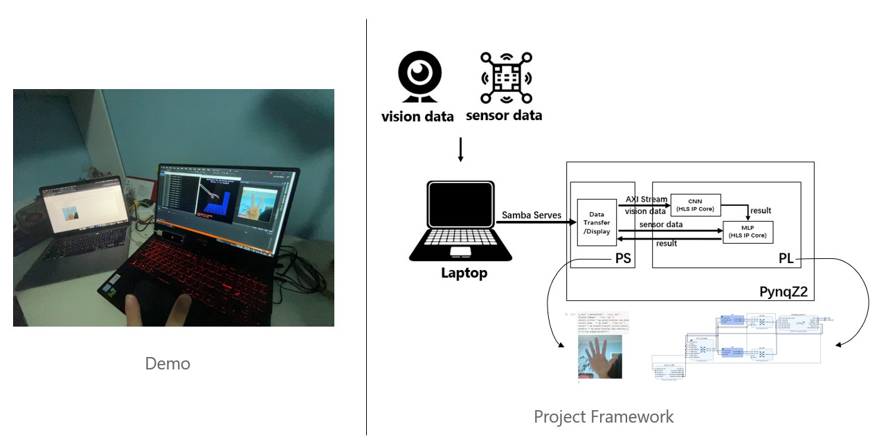

# Multimode sensing based on PynqZ2
## 1.Brief Introduction
This project presents a multimodal information processing platform based on PynqZ2 (In this project, traditional computer vision signals are combined with Leap Motion sensory signals).Thanks to PYNQ platform, we can easily wrapper the FPGA drivers into simple python code.
## 2.Project Framework

In this project,PynqZ2 acts as a edge computing platform.Laptop collect the multimodal information and then transfer to PynqZ2 using Samba serves.In the framework of PynqZ2,PS in charge of data transfer and display result on jupyter notebook.PL in charge of data processing,we use HLS tools to generate some IP cores aimed to accelerate the nerual network computing.Owing to the parallelism of FPGA,we get a 4x Speed compared to ARM only.

## 3.Repository Organisation
This repository is organized as follows.
- `source`: contains the source files of HLS IP cores and the `.tcl` file for rebuilting hardware design..
- `notebooks`: contains notebook for displaying.
- `data`: contains the data for running the project(`.bit` file,`.hwh` file).

## 4.Hardware Design Rebuilt 
In order to rebuild this hardware design, you should clone this repo in a machine installed with `Vivado 2018.3`(only tested with `Vivado 2018.3`).
1. Clone this repo.
2. Change your work directory.
3. Make sure you have successfully configure you vivado environments and then source the .tcl file.
4. Wait for a minute and then you can open the new-built projects.

@ 2020 SEU-Xilinx International Summer Camp
